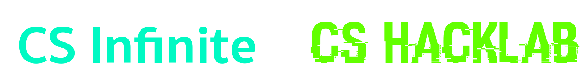

# Welcome to short course Practical Web Application Security and Testing

### Table of contents
- [Introduction](#introduction)
- [Course Outline](#course-outline)
- [Course Materials](#course-materials)
- [Prerequisites](#prerequisites)

## Introduction
This short course is designed to provide a practical introduction to web application security and testing. If you a re beginner here, don't worry, we will start from the very beginning. Course structure will be:
- Lecture (I know, I know)
- [Exploitation Showcase](#exploitation-showcase)

## Course Outline
- OWASP
- Servers and Clients concept
- Penetration Testing
- Vulnerability and Exploitation
- Exploitation labs

## Course Materials
Presentation and Lab Script will be available in this repository in `Materials` folder. You can clone this repository or download it as zip file. If you are not familiar with git, you can download it as zip file by clicking on the green button `Code` and then `Download ZIP`.

## Prerequisites
Some basic knowledge of web application development and networking will be helpful. However, we will start from the very beginning, so don't worry if you don't have any knowledge about web application development and networking.
### OS and Environment
- Linux OS **(Strongly recommended KALI Linux)**
- VirtualBox or VMWare (In case of you not bare metal Linux user)
- Docker Desktop 
- **Lots of RAM** 

### Tools 
**If you are using KALI Linux, most of the tools are already installed**

The following tools is the tools you need to download and install (Not installed by default in KALI Linux)
- Burp Suite Community Edition
- Dirbuster

and many more. We will install them as we go.

## Exploitation showcase
- Reconnaissance
- Broken Access Control
- Broken Authentication
- Cross-Site Scripting (XSS)
- Local Variable Manipulation
- Null Byte Poisoning
- Open Source Intelligence (OSINT)
- Password Cracking
- Privilege Escalation
- Reverse Shell
- Server-Side Template Injection (SSTI)
- SQL Injection (SQLI)
- URL Encoding

 

 

<h4> Version 2.13</h4>
